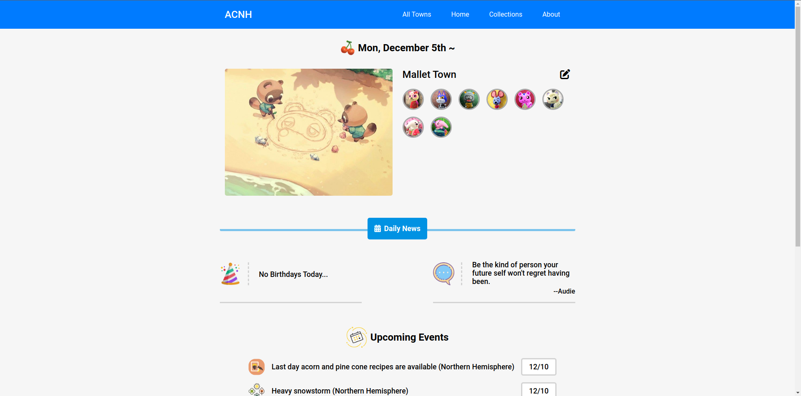
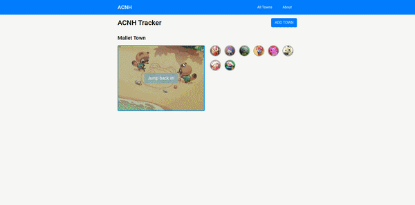

# ACNH Tracker

A dynamic HTML, CSS, and JavaScript web application for Animal Crossing New Horizons enthusiasts who want to track their town progress.

## Why Build This?

When Animal Crossing New Horizons came out during the pandemic, I used a critterpedia tracking site to keep track of my collections data. The site had a draggable critterpedia menu that I thought would make for a really cool challenge after finishing initial CRUD operations for user town data. I also just LOVE Animal Crossing...

## Technologies Used:

- HTML5
- CSS3
- JavaScript
- XML / AJAX
- [ACNHapi](http://acnhapi.com/)
- [Nookipedia API](https://api.nookipedia.com/)

## Live Deployment

https://cam-peck.github.io/acnh-tracker/

## MVP Features

- User Can Create a Town
- User Can View Their Towns
- User Can View Their Town's Home Page
- User Can Edit Town Information
- User Can Delete Their Town

## Implemented Stretch Features

- User Can View the Critterpedia
- User Can Interact with the Critterpedia
- User Can View the About Page

## Future Stretch Features

- User Can Quick-Select Collection Items
- User Can Crop Their Town Photo

## Preview

